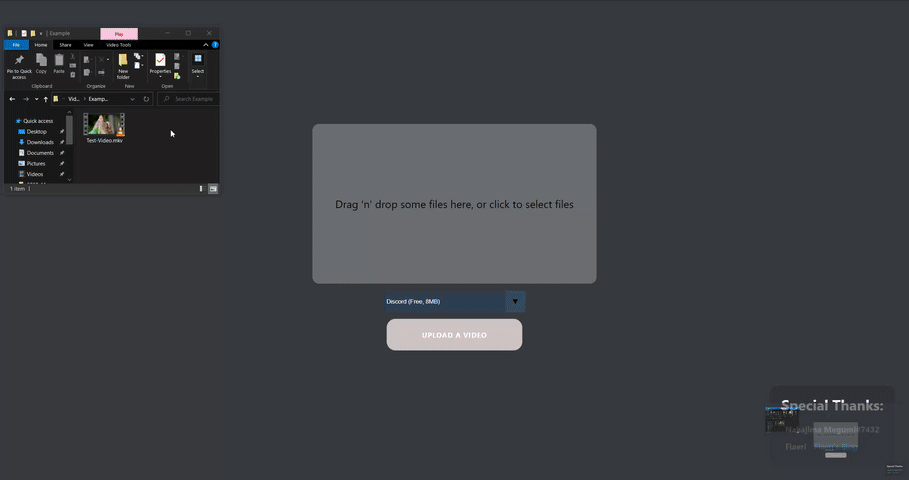

<!--
*** Thanks for checking out this README Template. If you have a suggestion that would
*** make this better, please fork the repo and create a pull request or simply open
*** an issue with the tag "enhancement".
*** Thanks again! Now go create something AMAZING! :D
***
***
***
*** To avoid retyping too much info. Do a search and replace for the following:
*** EladKarni, limbo-encoder, twitter_handle, email
-->


<!-- PROJECT SHIELDS -->
<!--
*** I'm using markdown "reference style" links for readability.
*** Reference links are enclosed in brackets [ ] instead of parentheses ( ).
*** See the bottom of this document for the declaration of the reference variables
*** for contributors-url, forks-url, etc. This is an optional, concise syntax you may use.
*** https://www.markdownguide.org/basic-syntax/#reference-style-links
-->
[![Contributors][contributors-shield]][contributors-url]
[![Forks][forks-shield]][forks-url]
[![Stargazers][stars-shield]][stars-url]
[![Issues][issues-shield]][issues-url]
[![MIT License][license-shield]][license-url]
[](https://app.netlify.com/sites/limbo-encoder/deploys)


<!-- PROJECT LOGO -->
<br />
<p align="center">
  <a href="https://github.com/EladKarni/limbo-encoder">
    
  </a>

  <h3 align="center">Limbo Encoder</h3>

  <p align="center">
    A simple tool designed to help you make videos smaller for uploading  
    <br />
    <br />
    <a href="https://limbo-encoder.netlify.app/">View Demo</a>
    ·
    <a href="https://github.com/EladKarni/limbo-encoder/issues">Report Bug</a>
    ·
    <a href="https://github.com/EladKarni/limbo-encoder/issues">Request Feature</a>
  </p>
</p>




<!-- TABLE OF CONTENTS -->
## Table of Contents

* [About the Project](#about-the-project)
  * [Built With](#built-with)
* [Getting Started](#getting-started)
  * [Installation](#installation)
* [Contributing](#contributing)
* [License](#license)


<!-- ABOUT THE PROJECT -->
## About The Project

This project is designed to help users make videos smaller without the need for FFmpeg knowlege or external programs. Everything runs locally, so even if you lose internet while the video is processing, you won't be interupted.

#### Current Targets
1.  8MB
2.  50MB
3.  100MB

These corispond to the different optoins you will get using Discord, depending on your Nitro status or the servers level.


### Built With

- [FFmpeg.WASM](https://ffmpegwasm.github.io/#demo)
- [React](https://reactjs.org/)
- [React-Dropzone](https://github.com/react-dropzone/react-dropzone)
- [RC-Progress](https://github.com/react-component/progress)


<!-- GETTING STARTED -->
## Getting Started

To get a local copy up and running follow these simple steps.

### Installation

1. Clone the repo
```sh
git clone https://github.com/EladKarni/limbo-encoder.git
```
2. Install packages
```sh
yarn
```
<!-- CONTRIBUTING -->
## Contributing

Contributions are what make the open source community such an amazing place to be learn, inspire, and create. Any contributions you make are **greatly appreciated**.

1. Fork the Project
2. Create your Feature Branch (`git checkout -b feature/AmazingFeature`)
3. Commit your Changes (`git commit -m 'Add some AmazingFeature'`)
4. Push to the Branch (`git push origin feature/AmazingFeature`)
5. Open a Pull Request


<!-- LICENSE -->
## License

Distributed under the MIT License. See `LICENSE` for more information.

<!-- MARKDOWN LINKS & IMAGES -->
<!-- https://www.markdownguide.org/basic-syntax/#reference-style-links -->
[contributors-shield]: https://img.shields.io/github/contributors/EladKarni/repo.svg?style=flat-square
[contributors-url]: https://github.com/EladKarni/repo/graphs/contributors
[forks-shield]: https://img.shields.io/github/forks/EladKarni/repo.svg?style=flat-square
[forks-url]: https://github.com/EladKarni/repo/network/members
[stars-shield]: https://img.shields.io/github/stars/EladKarni/repo.svg?style=flat-square
[stars-url]: https://github.com/EladKarni/repo/stargazers
[issues-shield]: https://img.shields.io/github/issues/EladKarni/repo.svg?style=flat-square
[issues-url]: https://github.com/EladKarni/repo/issues
[license-shield]: https://img.shields.io/github/license/EladKarni/repo.svg?style=flat-square
[license-url]: https://github.com/EladKarni/repo/blob/master/LICENSE.txt
[linkedin-shield]: https://img.shields.io/badge/-LinkedIn-black.svg?style=flat-square&logo=linkedin&colorB=555
[linkedin-url]: https://linkedin.com/in/EladKarni
[product-screenshot]: images/screenshot.png